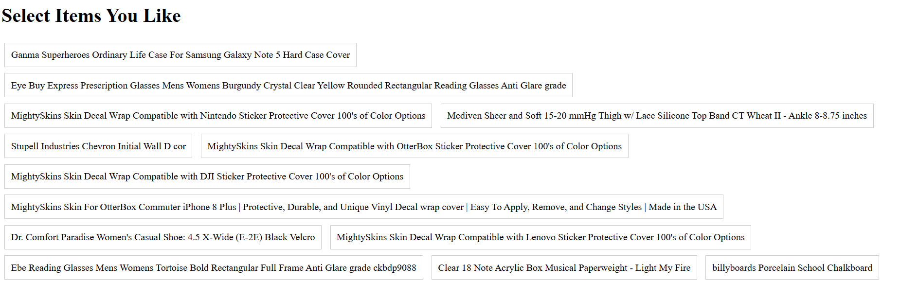
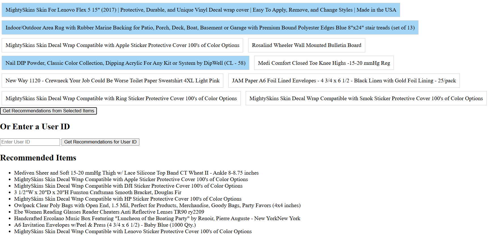

# Recommender Engines Project
Small project to explore hybrid recommender systems as part of my Recommender Engines course. 
## Overview
This project is a Flask-based web application that implements a hybrid recommender system. The system generates personalized product recommendations using both collaborative filtering and content based filtering. Users can receive recommendations by either selecting items or providing a user ID. There is a (very simple and not pretty) UI to be able to interact with the recommendations. The data was freely available online (anonymized) and linked in the data folder.

## Features
- **Homepage**: Displays a list of items that users can select for generating recommendations.
- **Recommendation System**:
  - Recommends items based on a given user ID. OR
  - Recommends items based on selected items from the item list.
- **Interactive API**: RESTful API endpoint to generate recommendations dynamically.
- **Method**: Both collaborative (based on similar users) and content (based on similar content) recommender methods. 

## Running the project: 
After installing the requirements, run:
python src/app.py

Below is an example of what the UI looks like:
First select items you are interested in:

Then you will get recommendations for items that you might like:
